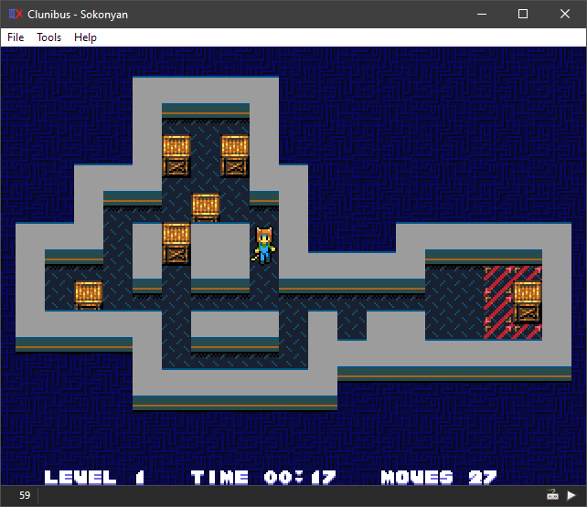

# Asspull IIIx
This is a fantasy computer that Kawa pulled out of his ass, inspired by [an utter shitpost](https://helmet.kafuka.org/byuugold/viewtopic.php@f=16&t=4792.html). That's really all there is to it; it's a joke gone way out of hand.

To actually *use* this, ROM files are included and more up-to-date copies can be gotten from [the other repo](https://github.com/Kawa-oneechan/Asspull3X-roms).

## First run
On first run, you must provide an A3X BIOS ROM (`apb`). One should be provided in the `roms` folder. Then you may load up any of the provided `ap3` ROM files.

## Controls
The emulator passes all presses of the *left* Control key to the A3X, while the *right* Control key controls the emulator itself.

| Key          | Effect 
|--------------|--------
| Ctrl L       | Load ROM
| Ctrl Shift L | Load disk image
| Ctrl U       | Unload ROM
| Ctrl Shift U | Unload disk image
| Ctrl R       | Reset the emulation
| Ctrl Alt R   | Reload last ROM, then reset emulation
| Ctrl D       | Dump memory to `wram.bin` and `vram.bin`
| Ctrl S       | Take a screenshot
| Ctrl A       | Toggle aspect correction
| Ctrk K       | Toggle keyboard gamepad control
| Ctrl P       | Pause
| Ctrl F10     | Toggle fullscreen mode

Disk image hotkeys refer to the *first* attached disk drive (`A:`). You'll need the Devices window to change images for any other drives.

Clicking the middle mouse button toggles mouse controls, for those applications or games that can use one.

The keyboard gamepad control feature reassigns the arrow keys and certain letters to the first gamepad, in case you don't have one.

| Key    | Button
|--------|--------
| Arrows | Directional pad
| Z      | A
| X      | B
| A      | X
| S      | Y
| C      | Start
| V      | Select
| D/F    | Shoulder buttons

The canonical (if nonexistant) A3X controller has the same ABXY layout as the Xbox, and any XInput gamepad should work (though the main author only has an old Logitech F310 to test with). Just in case, there's some ability to remap the buttons.

## Acknowledgments
* French localization help by Thomas_⑨.
* Hungarian localization help by Letrune.
* Massive interrupt help by [Invertego](https://github.com/invertego).
* OpenGL shader thing based on [an example by Augusto Ruiz](https://github.com/AugustoRuiz/sdl2glsl).
* PAL Composite shader by Viacheslav Slavinsky.
* CRT shader by Timothy Lottes.
* [CRTView](https://github.com/mattiasgustavsson/crtview) shaders by Mattias Gustavsson.
* [miniz](https://github.com/richgel999/miniz) library by Rich Geldreich.
* [SimpleIni](https://github.com/brofield/simpleini) library by Brodie Thiesfield.

